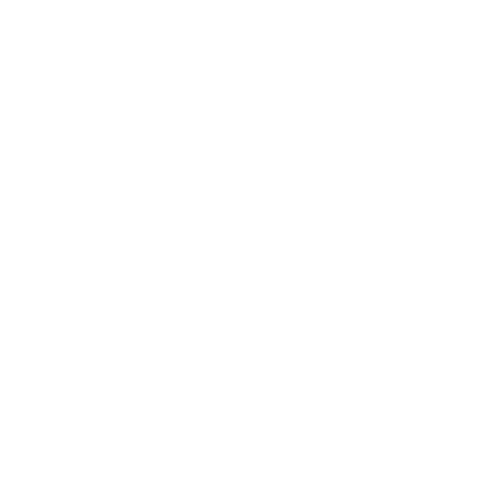
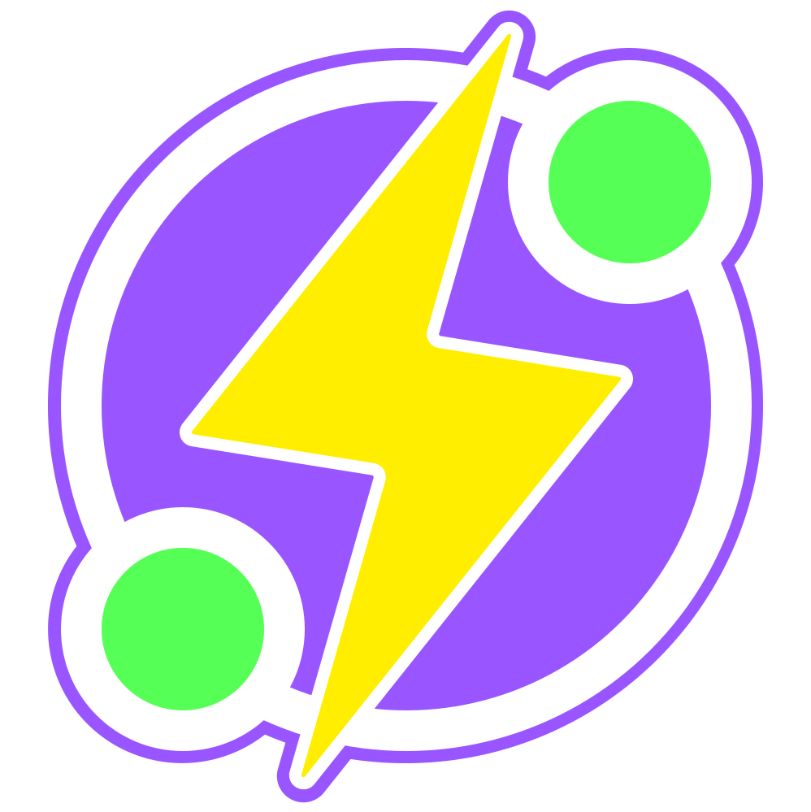
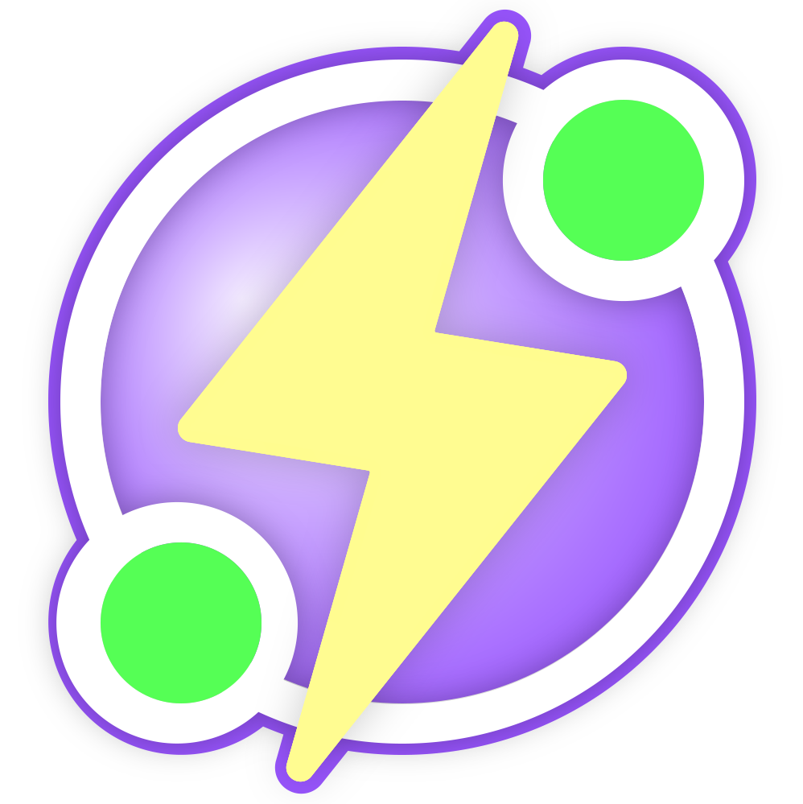
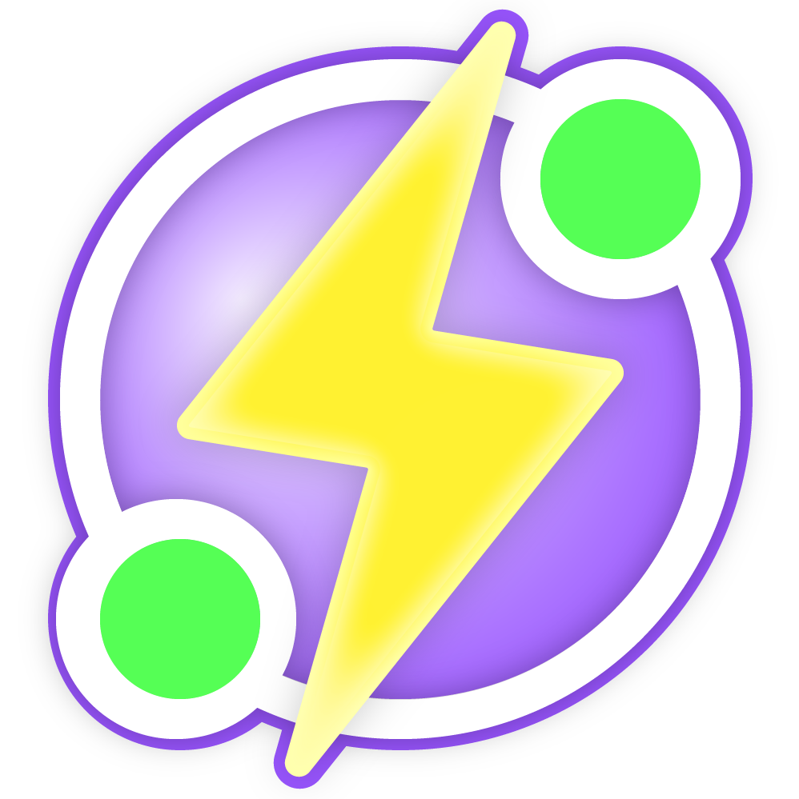
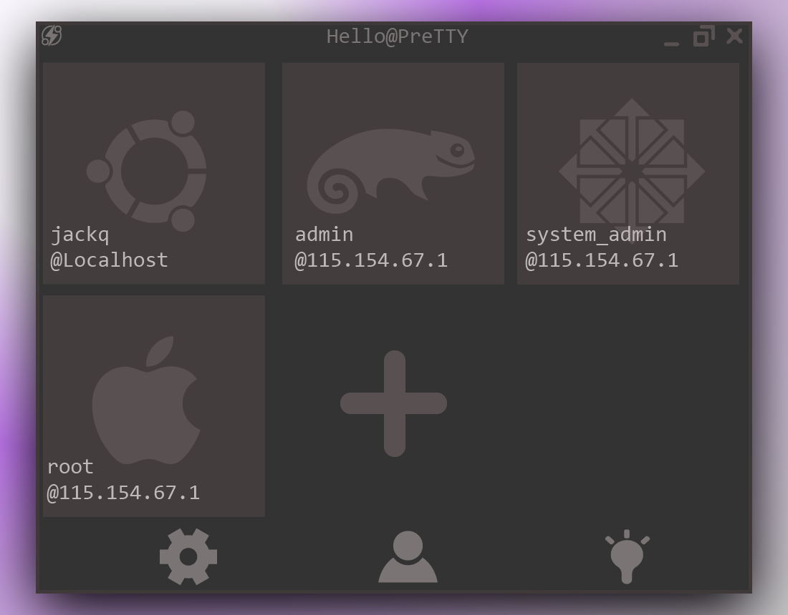
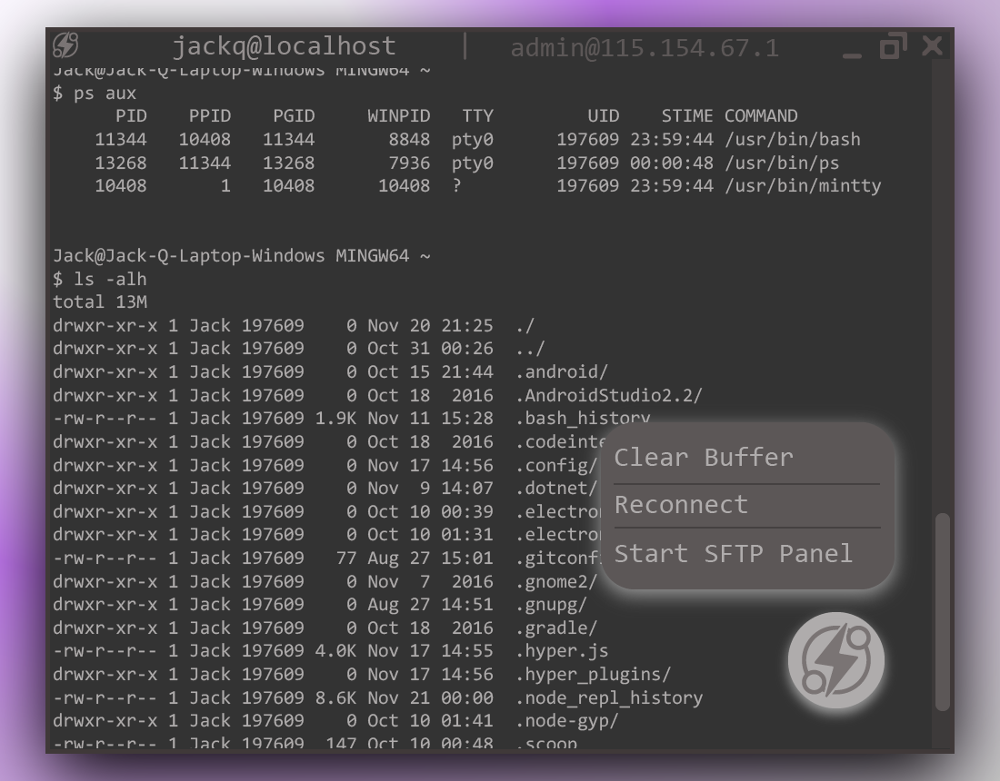

# Artworks

This folder contains relevant artworks for this project.

## Icon

* Draft version 0

  | type                             | preview                   |
  |:--------------------------------:|:-------------------------:|
  |[svg version](./icon-draft-0.svg) | |

* Draft version 1

  | type   | preview (svg)                        | preview (png) |
  |:------:|:------------------------------------:|:--------------------------:|
  | White  |  | |
  | Mono   |  | |
  | Flat   |  | |
  | Color  |  | |

  (SVGs are exported via Illustrator, which may not rendered correctly in preview mode)

  [Adobe Illustrator File](./icon-draft-1.ai)

## User Interface

* Welcome Screen
  
  [Adobe Illustrator File](./ui-draft/welcome-screen.ai)

* Connection Session
  
  [Adobe Illustrator File](./ui-draft/connection-session.ai)
